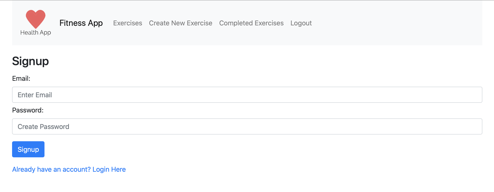

# FitnessApp

### View Online

[Visit the site here](http://exercisetracker.info)



### Run Locally
You can clone the repo.

In the root directory run
```
npm install
```

Then in the client directory run
```
npm install
```

You would then be able to run the react app if you are in the client directory and run
```
npm start
```

You would then need to create your own mongo atlas db and put in your connection uri into function.
#### Server.js
```javascript
mongoose.connect(YOUR_DB_URI, {
    useNewUriParser: true,
    useUnifiedTopology: true,
    useCreateIndex: true,
}).then(() => {
    console.log("Connected to the Mongo Atlas Database");
}).catch(err => console.log(err));
```
